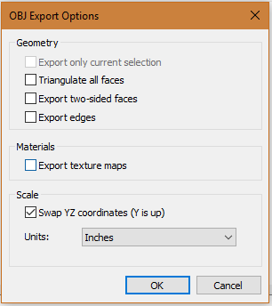
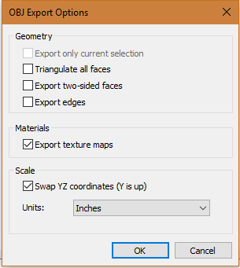

# Big Ridge Outdoor Kitchens Configurator

# Adding a new module

1. To add a new module, open a sketchup file and click `File -> Export -> 3D Model`
2. In the dialog box that opens up, set `Save as type:` to `OBJ File (*.obj)`
3. Click `options` in the dialog box and make sure the options match with the picture below\

3. Navigate in this repository to the folder you'd like to use and upload the resulting `.obj` file from the last step using the `Upload files` button. You'll need to add a message describing the additions and then click `Commit changes`.
4. Navigate to the root directory and click the file `config.yaml`
5. Click the  button just above the start of the file and to the right. 
6. Copy and paste one of the existing modules. Each module starts with `- name: NAME` and ends with a blank line. Edit it to match the name and location of the file you uploaded.

# Materials

All of the materials used are consolidated into the `base-materials.mtl` file in the root of this repository.

Each material in the file is preceded by `newmtl` then the name of the material. These are the only material names you can use in a sketchup file. In order to add a new material to the `base-materials.mtl` file, do the following:

1. Export the sketchup file as specified above with the following options (still `Save as type: OBJ File (*.obj)`)\

2. Open the resulting `.mtl` file
3. Find the new material that does not currently exist in `base-materials.mtl` and copy the new material code block down to the next blank line
4. Edit the `base-materials.mtl` file in this repository and paste the copied material onto the bottom.
5. If the material references a texture on the last line like `map_Kd FOLDER/TEXTURE_FILE.jpg`\
  a. remove all the folders above the jpg file so it looks like `map_Kd TEXTURE_FILE.jpg`\
  b. Find the resulting texture `.jpg` file from the first step and upload it to the `textures` folder in this repository
6. Upload the resulting `.obj` file from the first step as described above.
